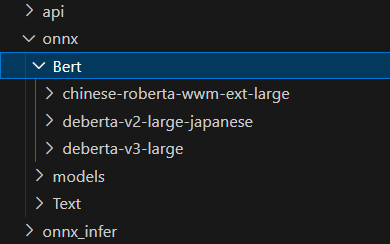
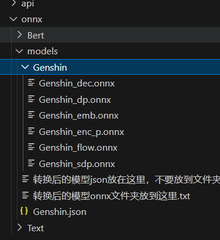
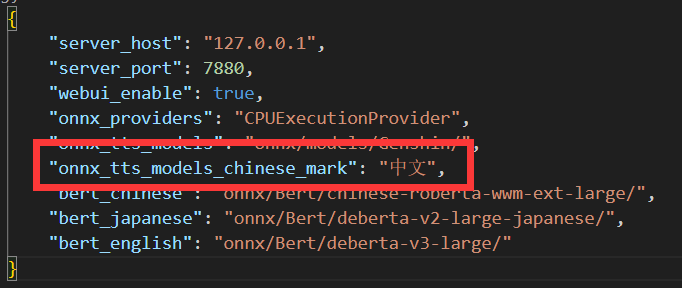
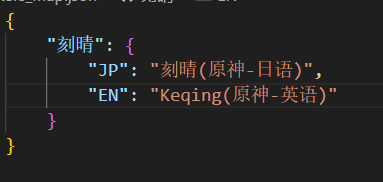
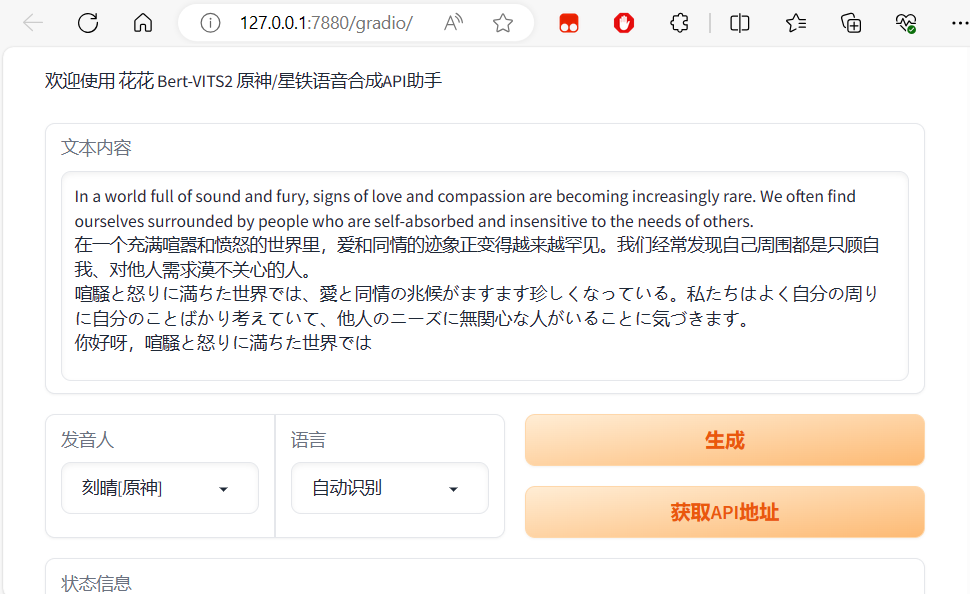
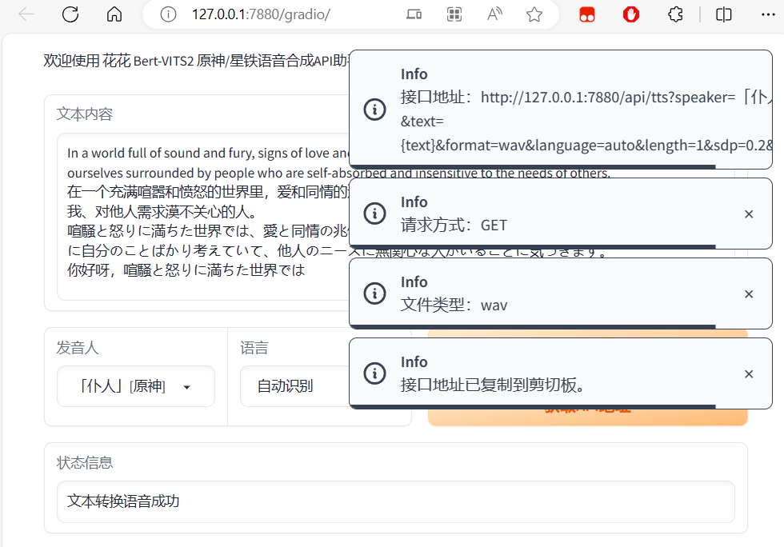
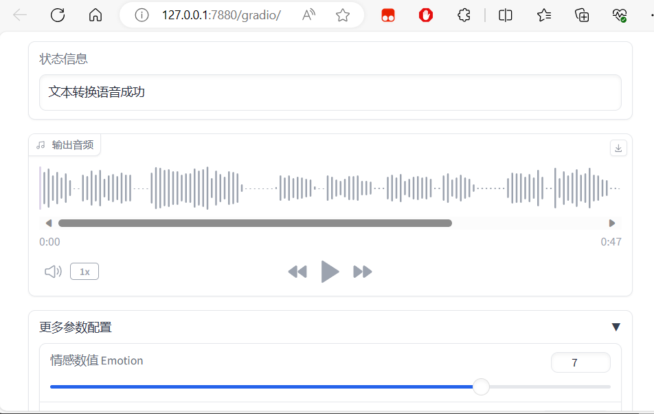
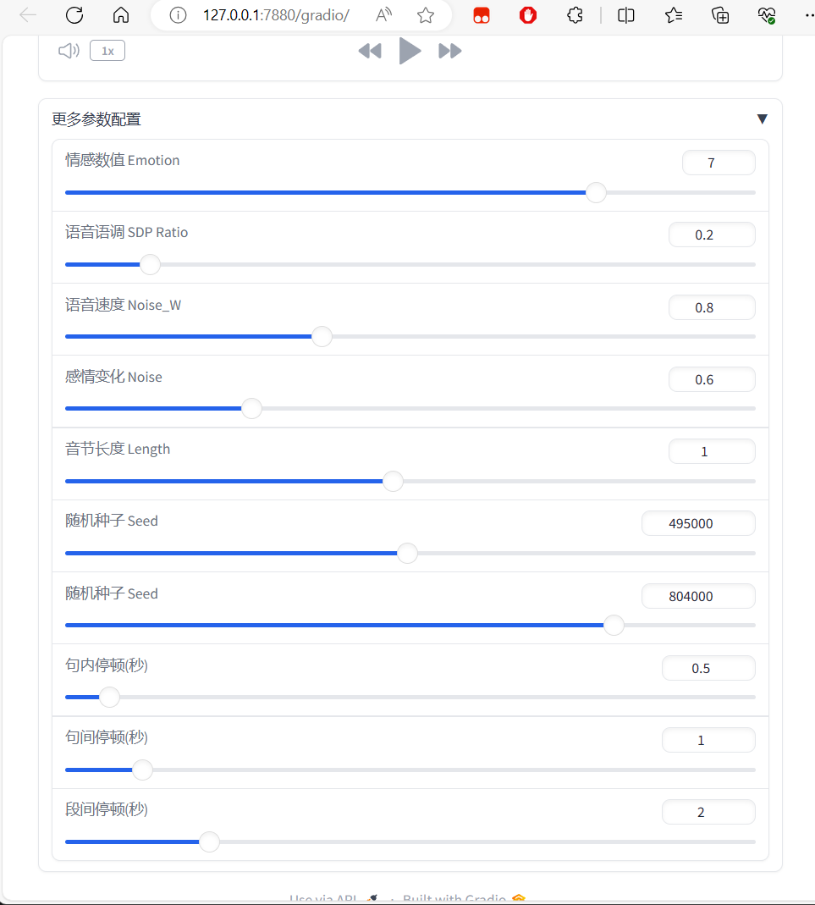
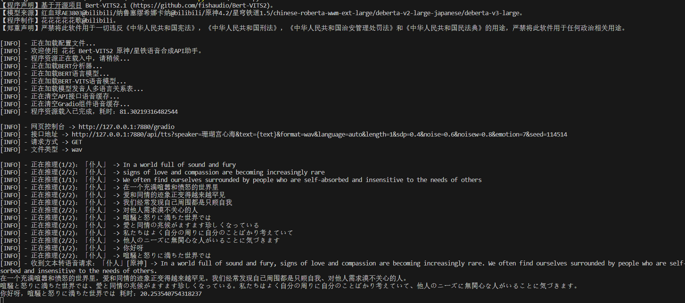

# Bert-VITS2 Speech

## 声明
+ 严禁将此项目用于一切违反《中华人民共和国宪法》，《中华人民共和国刑法》，《中华人民共和国治安管理处罚法》和《中华人民共和国民法典》之用途。
+ 严禁用于任何政治相关用途。

## 项目说明
+ 基于开源项目[fishaudio/Bert-VITS2 2.1](https://github.com/fishaudio/Bert-VITS2/tree/2.1) 实现
+ 去除所有训练相关代码，仅保留onnx模型推理能力，重写调用推理代码
+ 重写WEBUI页面，剔除切分生成功能，生成时自动切分，支持多语言多段落混合输入
+ WEBUI支持一键获取TTS API地址

## 运行环境
+ python == 3.10

## 安装说明

`pip install -r requirements.txt`

## 使用说明

下载中/日/英bert对应onnx模型，放入项目 onnx/Bert目录对应文件夹内 [下载链接](https://openi.pcl.ac.cn/Shirakana/Bert/modelmanage/show_model)

转换[fishaudio/Bert-VITS2 2.1](https://github.com/fishaudio/Bert-VITS2/tree/2.1)版本（仅适用2.1版本）训练后的模型pth文件为onnx，然后将onnx模型文件夹连同json文件放到onnx/models文件夹下。模型转换方法看下方。

  
修改配置文件 config.json，修改 onnx_tts_models_chinese_mark 字段为模型内角色名称的中文标志字符

如 角色名称：刻晴(原神-中文), 中文标志字符："中文"、角色名称：刻晴_ZH, 中文标志字符："ZH"

修改角色多语言映射文件 speakers_map.json，如果不指定，则在进行多语言输出时，仅使用中文角色进行推理

## 训练模型转ONNX说明

（仅适用2.1版本）

运行 [fishaudio/Bert-VITS2 2.1](https://github.com/fishaudio/Bert-VITS2/tree/2.1) 项目根目录下的 export_onnx.py 进行导出。

## 界面截图

## References
+ [fishaudio/Bert-VITS2 2.1](https://github.com/fishaudio/Bert-VITS2/tree/2.1)

### 最后，感谢Bert-VITS2项目组的努力与群里大佬们的答疑